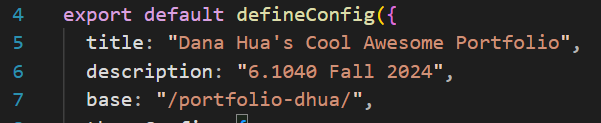

## Broad Application Goals

My app will be designed for the older generation. It'll provide 

Name: 
Intended audience:
An older population that considers themselves to be "principled" individuals. I found that. 
Value: Content that is heavily personalized to the user's point of view, 

## Scrapbook of Comparables

## Brainstorming Feature Ideas

1. Family Video Wall:   
A video-sharing space where users can post short, private video messages to family members. It offers a controlled environment for meaningful video-based connections without the noise of public content.
2. Simplified Feed:  
A minimalist feed that only shows important updates from selected contacts, like family and close friends, without irrelevant posts or ads. No clutter, just focus on essential content.
3. Trusted News Hub: 
Curated, reputable news sources that the user can subscribe to, ensuring they receive accurate and informative content. Users can personalize this hub based on topics of interest.
4. Value-Based Filtering:    
A content filter that allows users to block content based on personal values, such as avoiding content deemed frivolous or low-quality. The algorithm learns over time to adapt to the user’s preferences.
5. Customizable Notifications:  
Fine-tuned notification settings that allow users to only receive alerts for specific types of communication, such as family messages or urgent news, minimizing distractions.
6. Guided Setup Assistant:  
A step-by-step onboarding assistant that helps new users set up their privacy settings, contact list, and content preferences, ensuring they aren’t overwhelmed by features.
7. Content Approval:  
Before a post appears in a user's feed, they have the option to approve or dismiss it, giving them control over what content reaches them, reducing unwanted surprises.
8. Privacy Zones:  
Create zones for different parts of life (family, friends, colleagues) where interactions are restricted to specific contacts, preventing personal info from being shared outside intended circles.
9. Senior Learning Center:  
A built-in resource hub with tutorials on digital literacy, safe browsing, and using app features. Helps users stay informed and comfortable navigating the platform.
10. Audio Messaging:  
A voice-based messaging system that allows users to send short audio clips to friends and family, reducing the need for typing and facilitating more personal communication.
11. Memory Lane:  
A feature that lets users store and revisit significant moments shared privately, such as video messages or important updates from family, providing a sense of continuity.
12. Focus Mode:  
A mode where all non-essential features (feeds, notifications) are disabled, and only basic communication (e.g., calls and messages) is active, reducing distractions during focus time.
13. Content Trust Ratings:  
Posts and news articles come with a trust rating, based on user feedback and external fact-checking, helping users assess the reliability of the content they engage with.
14. Personalized Calendar:  
An integrated calendar that syncs with family members’ important dates (birthdays, events), making it easy for users to stay connected and be reminded of key occasions.
15. Cultural and Educational Groups:  
A feature that connects users with groups based on shared interests like language learning, cultural events, or educational discussions, helping them pursue personal growth.
16. Mood Check-In:  
A mood-based feed where users can set their emotional state, and the platform adjusts content accordingly. If they’re feeling stressed, for example, it will prioritize calming, uplifting content.
17. Voice-Activated Assistance:  
A hands-free mode with voice commands to navigate the app, send messages, or search for content. Ideal for users who might prefer not to type or use complex gestures.
18. Content Review Queue:  
Users can create a “review later” list for content that seems interesting but doesn’t have time to check immediately, helping them manage their time better.
19. Respect Meter:  
An optional feature that alerts users when a post or comment may come across as offensive or inappropriate, promoting respectful interactions and allowing users to avoid offending others unintentionally.
20. Safe Sharing Mode:  
Users can enable a feature that automatically limits who can see specific posts, such as sharing a family photo only with close relatives rather than all contacts.

These features are designed to prioritize communication, privacy, and user control while avoiding the excess and distractions often found in mainstream social media platforms.

## VSD Analysis

# Stakeholders:

# Time:

# Pervasiveness:

# Values:

## Storyboarding and sketching

Sharing content to "close friends":

