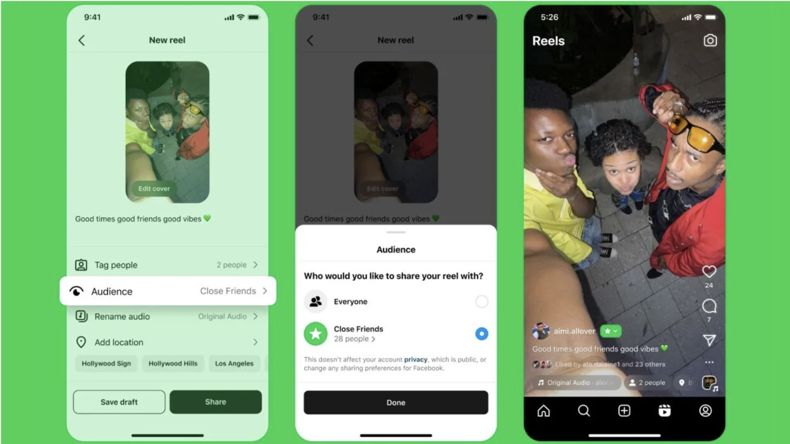
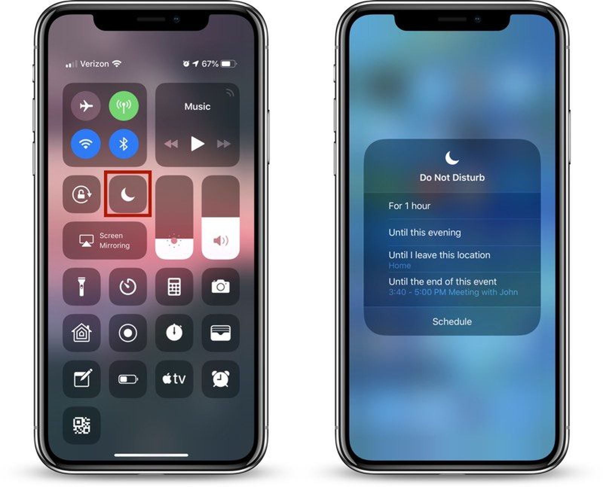
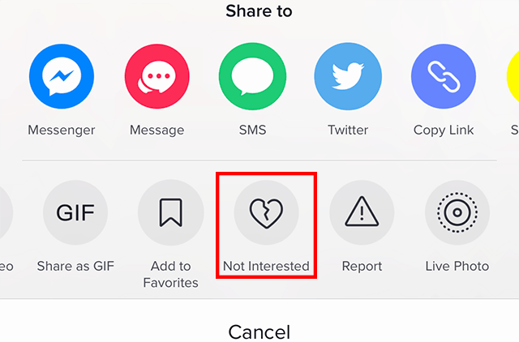
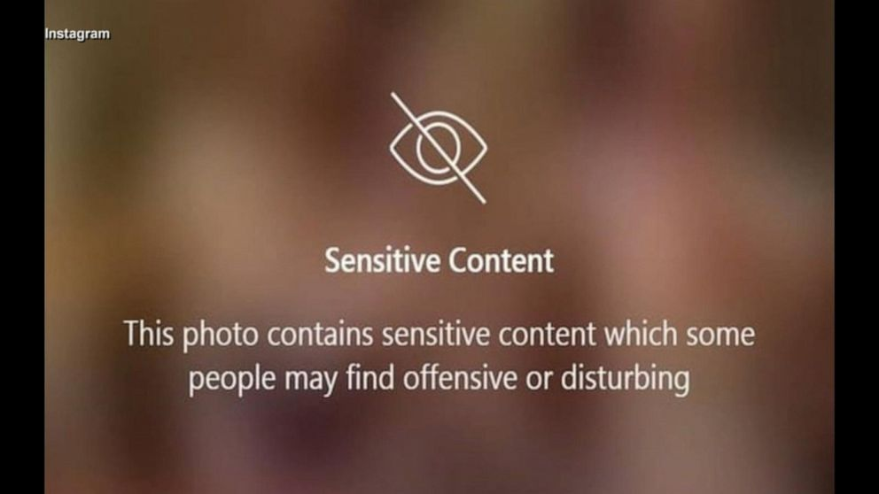

## Broad Application Goals

Name: Harmony   

Intended audience:  
An older population that considers themselves to be "principled" individuals and care about sharing moments with family.

Value:  
Content that is heavily personalized to the user's values, providing tools so the user can control who they share content with, whose content they see, and navigate app features easily so they can stay in contact with those they care about.

## Scrapbook of Comparables

Here is a depiction of how one would use the "Close Friends" list on Instagram. Could we use a similar concept to help our users control who sees what and feel more comfortable sharing special moments... giving them the sense of sharing to family and friends rather than to strangers?

iPhone's DND feature silences calls, alerts, and notifications. Mainly though, the point is to not... disturb, the user. How could we provide a service on the app to keep users from feeling bombared by content (i.e. only see approved content or block the content algorithm from testing new content with the user), handing a greater sense of control back to the user?  

TikTok's "Not Interested" option provides the user with the option to customize their "For You Page." i.e. helping to customize the algorithm that feeds them content. Let's think about how to apply a similar tool that will allow the app to respond to user feedback.
SideNote: Let's also consider the differences between TikTok's "Not Interested" and YouTube's "Dislike" button and how they change a user's perspective.

Once a YouTube video finishes playing, you get a one frame preview of what the next auto-played video will be. Considering that the userbase wants to avoid "disturbing" or "foolish" content, one could apply this frame preview so that the user can decide if they want to view that content.

Instagram implements a blur and warning if the content has been found to be disturbing. Related to idea above, we could apply something similar onto the frame previews.

## Brainstorming Feature Ideas

1. Family Video Wall:   
A video-sharing space where users can post short, private video messages to family members. It offers a controlled environment for meaningful video-based connections without the noise of public, external content.
2. Simplified Feed:  
A minimalist feed that only shows important updates from selected contacts, like family and close friends, without irrelevant posts or ads. No clutter, just focus on essential content.
3. Trusted News Hub: 
Curated, reputable news sources that the user can subscribe to, ensuring they receive accurate and informative content. Users can personalize this hub based on topics of interest.
4. Value-Based Filtering:    
A content filter that allows users to block content based on personal values, such as avoiding content deemed frivolous or low-quality. The algorithm learns over time to adapt to the user’s preferences.
5. Customizable Notifications:  
Fine-tuned notification settings that allow users to only receive alerts for specific types of communication, such as family messages or urgent news, minimizing distractions.
6. Guided Setup Assistant:  
A step-by-step onboarding assistant that helps new users set up their privacy settings, contact list, and content preferences, ensuring they aren’t overwhelmed by features.
7. Content Approval:  
Before a post appears in a user's feed, they have the option to approve or dismiss it, giving them control over what content reaches them, reducing unwanted surprises.
8. Privacy Zones:  
Create zones for different parts of life (family, friends, colleagues) where interactions are restricted to specific contacts, preventing personal info from being shared outside intended circles.
9. Senior Learning Center:  
A built-in resource hub with tutorials on digital literacy, safe browsing, and using app features. Helps users stay informed and comfortable navigating the platform.
10. Audio Messaging:  
A voice-based messaging system that allows users to send short audio clips to friends and family, reducing the need for typing and facilitating more personal communication.
11. Memory Lane:  
A feature that lets users store and revisit significant moments shared privately, such as video messages or important updates from family, providing a sense of continuity.
12. Focus Mode:  
A mode where all non-essential features (feeds, notifications) are disabled, and only basic communication (e.g., calls and messages) is active, reducing distractions during focus time.
13. Content Trust Ratings:  
Posts and news articles come with a trust rating, based on user feedback and external fact-checking, helping users assess the reliability of the content they engage with.
14. Personalized Calendar:  
An integrated calendar that syncs with family members’ important dates (birthdays, events), making it easy for users to stay connected and be reminded of key occasions.
15. Cultural and Educational Groups:  
A feature that connects users with groups based on shared interests like language learning, cultural events, or educational discussions, helping them pursue personal growth.
16. Mood Check-In:  
A mood-based feed where users can set their emotional state, and the platform adjusts content accordingly. If they’re feeling stressed, for example, it will prioritize calming, uplifting content.
17. Voice-Activated Assistance:  
A hands-free mode with voice commands to navigate the app, send messages, or search for content. Ideal for users who might prefer not to type or use complex gestures.
18. Content Review Queue:  
Users can create a “review later” list for content that seems interesting but doesn’t have time to check immediately, helping them manage their time better.
19. Respect Meter:  
An optional feature that alerts users when a post or comment may come across as offensive or inappropriate, promoting respectful interactions and allowing users to avoid offending others unintentionally.
20. Safe Sharing Mode:  
Users can enable a feature that automatically limits who can see specific posts, such as sharing a family photo only with close relatives rather than all contacts.

These features are designed to prioritize communication, privacy, and user control while avoiding the excess and distractions often found in mainstream social media platforms.

## VSD Analysis

# Stakeholders:
Observation:    
Direct stakeholders include older users (our target demographic), while indirect stakeholders would be the younger family members who may help older users navigate the app, as well as advertisers or content creators who provide content. Younger family members may worry about privacy and content filtering on behalf of their older relatives.   
Design Response:     
Introduce a Family Admin Role, where a trusted family member can assist with settings, privacy controls, and content filtering for the older user without taking control away from them.

Observation:    
Younger family members who understand technology better than our target audience would be indirect stakeholders. Older users might ask younger family members for help navigating the app, perhaps at times acting as a nuisance.   
Design Response:     
Related to the Senior Learning Center feature idea. We can walk users through a tutorial upon app installation and also store tutorials for app features within the platform (a tutorial tab of some sorts). 

# Time:
Observation:    
Over time, religious or cultural groups could appropriate the app as a communication tool for cultural practices, e.g., organizing community events or sharing religious or cultural content in a trusted space. Due to the, controlled, nature of the app, this could foster community cohesion but may also create echo chambers.  
Design Response:    
Create Cultural Connect Hubs with opt-in moderation for groups to maintain a respectful, trusted space, while offering cross-cultural content recommendations that expose users to other cultures in a non-intrusive way.

Observation:    
As generations age with the app, younger users might perceive the app as slow or outdated, while older users might appreciate its simplicity. This generational gap can affect the platform’s longevity.    
Design Response:    
Introduce a Generational View Mode that tailors the interface for different age groups. Younger users might get a more dynamic interface, while older users retain the simplicity and communication focus, ensuring it remains relevant across generations. Another consideration would be that younger users get UI updates earlier, while older users only integrate them once they've been tested with the older population enough.

# Pervasiveness:
Observation:    
In countries with restrictive governments or heavy censorship, the app could face challenges in protecting user privacy while complying with local laws. In democratic nations, users might expect strong privacy guarantees and transparent content moderation.    
Design Response:    
Implement Country-Specific Privacy Settings that adapt based on the legal context, but always provide clear explanations to users about data handling and offer end-to-end encryption for communication features to maintain privacy regardless of the country.

# Values:
Observation:    
A value tension exists between users’ desire for the freedom to express and control their interactions and the need for security, ensuring privacy and protection from misinformation or harmful content.   
Design Response:    
Include Context-Aware Security Prompts that offer users proactive recommendations on strengthening their privacy settings or blocking unverified content, while still allowing them to maintain control over how strict these settings are.

## Storyboarding and sketching

Sharing content to "close friends":

