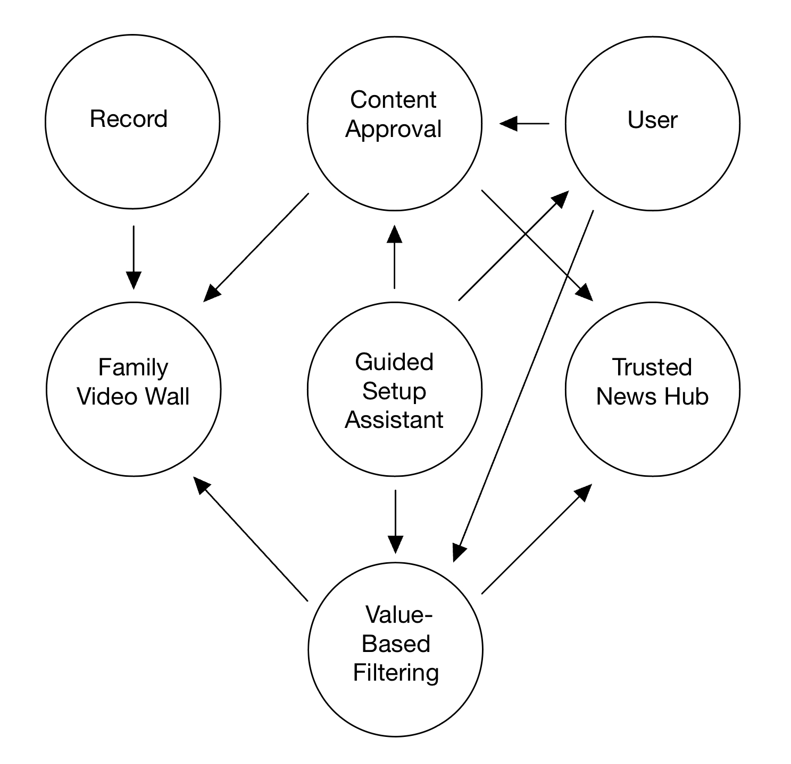
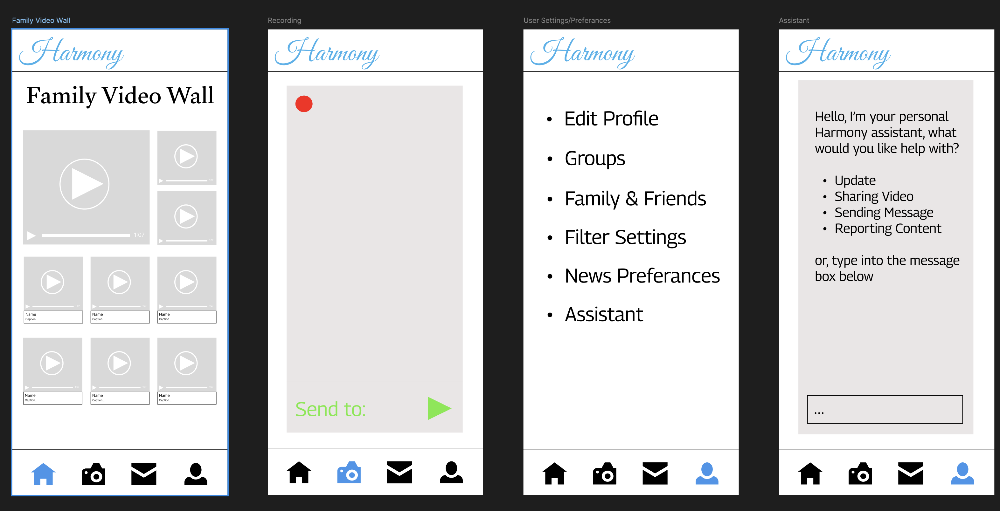

## Pitch
Introducing Harmony, the social media platform designed for older adults who value meaningful, distraction-free connections with family and close friends. Harmony is built on the principles of privacy, simplicity, and content control, offering users a serene space to engage with what matters most: relationships and trustworthy content. Harmony is a platform that offers simple, intuitive tools with robust privacy. Through **Value-Based Filtering**, Harmony filters out content that doesn’t align with the user’s values or preferences, ensuring a focused, relevant experience. When paired with **Content Approval**, where the user gets a preview of new content and the opportunity to dismiss it, Harmony assures quality content.

Our audience includes individuals who seek a more intentional and personalized experience online, as well as family connection. A **Family Video Wall** allows for sharing personal videos with loved ones and close family friends. Harmony is a breath of fresh air, where users stay informed with reliable news sources through our **Trusted News Hub**, providing curated, informative content. With a **Guided Setup Assistant** to help new users with the onboarding process, manage/explain updates, and serve as a resource for users to ask questions about app customization, Harmony ensures users understand the platform and how to manage its settings. Overall, Harmony is a platform designed for those who want a more thoughtful, enjoyable, and private way to stay connected.

## Concepts

# User
- Purpose: Represent individuals who interact with the app, allowing them to manage their profiles, preferences, and interactions within the family environment.
- Principle:
A user can create a profile, manage their preferences, and interact with other users.
The actions taken by the user will reflect their state and preferences in the app.
- State:
    - registered: set User
    - username, age: registered -> one String
    - preferences: registered -> set String
    - connectedUsers: registered -> set User
- Actions:
    - register (username: String, age: int, out user: User):
        - user not in registered
        - registered += user
        - user.username := username
        - user.age := age
    - updateProfile (user: User, preferences: set String):
        - user in registered
        - user.preferences := preferences

# Record
- Purpose: Enable users to create and manage audio or video recordings within the app.
- Principle: After a user initiates a recording, they can capture audio or video, save it, and manage it later.
- State:
    - activeRecordings: set Recording
    - content: activeRecordings -> one Media (audio/video)
    - author: activeRecordings -> one User
    - timestamp: activeRecordings -> one Date
    - status: activeRecordings -> one Status (e.g., recording, paused, stopped)
- Actions:
    - start (out recording: Recording)
        - no recording in activeRecordings
        - activeRecordings += recording
        - recording.author := currentUser
        - recording.timestamp := now
        - recording.status := recording
    - pause (recording: Recording):
        - recording in activeRecordings and recording.status = recording
        - recording.status := paused
    - resume (recording: Recording):
        - recording in activeRecordings and recording.status = paused
        - recording.status := recording
    - stop (recording: Recording, out content: Media):
        - recording in activeRecordings and (recording.status = recording or recording.status = paused)
        - content := recording.content
        - activeRecordings -= recording
        - recording.status := stopped
    - delete (recording: Recording):
        - recording in activeRecordings and recording.author = currentUser
        - activeRecordings -= recording
    - share (recording: Recording, user: UserT):
        - recording in activeRecordings
        - send recording to user

# Family Video Wall 
- Purpose: Allows users to share private video messages with family members, fostering close connections without public exposure.
- Operational Principle: Users record and post short video messages that are visible only to a defined group (e.g., family). Family members can reply with video messages, maintaining a private conversation space.
- State:
    - Videos: a set of shared media {Video1, Video2, …, VideoN}.
    - Members: A set of users {User1, User2, …, UserN} who have viewing access to the Wall.
    - VisibilitySettings: Customizable settings {Public, FamilyOnly, Custom} for each video.
- Actions:
    - UploadVideo(User, Video): Upload a new video to the family video wall.
    - TagVideo(User, Video, Tags): Assign tags to videos for easy sorting.
    - CommentOnVideo(User, Video, Comment): Add comments to videos.

# Value-Based Filtering 
- Purpose: Filters out content that doesn’t align with the user’s values or preferences, ensuring a focused, relevant experience.
- Operational Principle: Users can set personal preferences for types of content they want to avoid (e.g., frivolous or low-quality content). The filter learns from user interactions and continuously improves.
- State: 
    - CoreValues: A set {FamilyTime, Learning, Health} representing user values.
    - FilterRules: Filter rules that apply to certain content types.
    - FilteredContent: A set of content {Content1, Content2, ..., ContentN} visible to users.
- Actions:
    - SetCoreValues(User, CoreValues): User selects their value-based content preferences.
    - FilterContent(User, CoreValues): Display content relevant to the selected values.

# Trusted News Hub 
- Purpose: Provides users with accurate and reputable news content, ensuring they stay informed without falling victim to misinformation.
- Operational Principle: Users subscribe to curated, verified news sources and topics of interest, and the app delivers trusted articles to their feed.
- State: 
    - NewsCategories: A set of topics {LocalNews, GlobalEvents, Science} for users to follow.
    - TrustedSources: A set {Source1, Source2, ..., SourceN} of vetted news providers.
- Actions:
    - SelectNewsCategories(User, NewsCategories): User chooses the types of news they wish to follow.
    - CurateNewsFeed(User, NewsCategories): Provide news updates based on chosen categories and trusted sources.
    - DisplayNews(User, News): Displays content to the News Hub.

# Guided Setup Assistant
- Purpose: Simplifies the onboarding process by helping new users set up privacy settings, contacts, and content preferences.
- Operational Principle: Users follow a step-by-step assistant that explains the app’s key features and walks them through configuring their settings.
- State: 
    - UserProgress: A set {Step1, Step2, ..., StepN} representing completed setup steps.
    - FeatureSuggestions: A set of recommended actions {ConnectWithFamily, SetupVideoWall}.
- Actions:
    - StartSetup(User): Initiate the guided setup for a new user.
    - CompleteStep(User, Step): Mark a step in the setup process as completed.
    - SuggestFeature(User, FeatureSuggestions): Recommend features based on progress.

# Content Approval
- Purpose: To give users control over the content they encounter, minimizing unwanted or surprising posts.
- Operational Principle: When a post is flagged as potentially sensitive or outside the user’s preferences, it appears blurred in the feed with an option to either approve or dismiss it. This lets the user decide whether to engage with the content, creating a more curated and comfortable browsing experience.
- State: 
    - PendingContent: A set of posts awaiting user approval {Post1, Post2, ...}.
    - ApprovedContent: A set of posts approved for the feed {PostA, PostB, ...}.
    - User preferences: {defined criteria for sensitive/unwanted content}.
- Actions:
    - ApproveContent(User, Post): Add a post to the feed after user approval.
    - DismissContent(User, Post): Remove a post from the pending list without adding it to the feed.

# Dependecy Diagram

## WireFrame: User, Record, and Family Video Wall
https://www.figma.com/design/pYQeRaFrxi6DQp8NDOYTHt/A3?node-id=0-1&t=qlH0TvsB00ubP7oh-1

Comment:
While constructing the wireframes and their flows, I realized that some of my concepts couldn't be expressed properly. Thus, I added in the "User" and "Recording" concepts into my Concepts list. I hadn't included them originally because I did not think they were "unique" enough, but realized that they were quite critical to the platform's design and would make more sense on wireframe.

P.S. this is also why those two concepts are written a bit different than the others, hope that's fine!

## Design Tradeoffs
1. Content Approval Visibility
- Options:
    - Show all posts immediately but allow users to hide them later
    - Blur/delay posts that require approval
- Rationale: I chose the second option, where posts are blurred/delayed until approved, to give users proactive control over content. This approach aligns with the goal of minimizing unwanted surprises while offering a smoother, curated experience.

2. Value-Based Filtering Complexity
- Options:
    - Allow full customization of filters by individual criteria
    - Use a preset filtering system based on key values (e.g., family-friendly, educational).
- Rationale: The second option, with preset filters, simplifies the user experience for the older demographic, reducing complexity and decision fatigue. It strikes a balance between control and ease of use, fitting the app's goal of intuitive design.

3. Family Video Wall Interactivity
- Options:
    - Make the Family Video Wall passive (only viewable content)
    - Allow comments, reactions, and shared memories.
- Rationale: The second option, with interactive features, fosters engagement and deeper family connections. Adding simple interaction options like comments encourages emotional bonds while keeping the interface uncluttered for the target audience.